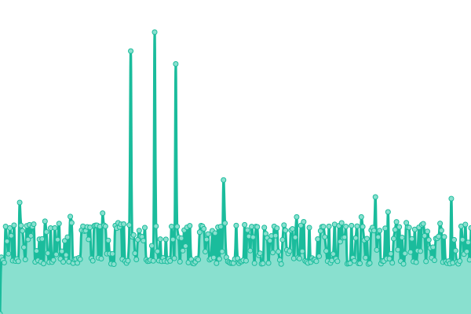

# [📈 Status en direct](https://Altearn.github.io/status): <!--live status--> **🟧 Partial outage**

This repository contains the open-source uptime monitor and status page for [Altearn](http://altearn.xyz), powered by [Upptime](https://github.com/upptime/upptime).

With [Upptime](https://upptime.js.org), you can get your own unlimited and free uptime monitor and status page, powered entirely by a GitHub repository. We use [Issues](https://github.com/Altearn/status/issues) as incident reports, [Actions](https://github.com/Altearn/status/actions) as uptime monitors, and [Pages](https://Altearn.github.io/status) for the status page.

## [📈 Live Status](https://demo.upptime.js.org): <!--live status--> **🟧 Partial outage**

<!--start: status pages-->
<!-- This summary is generated by Upptime (https://github.com/upptime/upptime) -->
<!-- Do not edit this manually, your changes will be overwritten -->
<!-- prettier-ignore -->
| URL | Status | History | Response Time | Uptime |
| --- | ------ | ------- | ------------- | ------ |
|  [Altearn website](https://altearn.xyz) | C'est pas pété | [altearn-website.yml](https://github.com/Altearn/status/commits/HEAD/history/altearn-website.yml) | 

 1531ms
     
 | 

<a href="https://status.altearn.xyz/history/altearn-website">100.00%</a>
    

|  [Gunivers website](https://gunivers.net) | C'est pas pété | [gunivers-website.yml](https://github.com/Altearn/status/commits/HEAD/history/gunivers-website.yml) | 

 1747ms
     
 | 

<a href="https://status.altearn.xyz/history/gunivers-website">100.00%</a>
    

|  [Evol Originel website](https://eoriginel.fr/) | C'est pas pété | [evol-originel-website.yml](https://github.com/Altearn/status/commits/HEAD/history/evol-originel-website.yml) | 

 1553ms
     
 | 

<a href="https://status.altearn.xyz/history/evol-originel-website">100.00%</a>
    

|  [Fat Man](fm.altearn.xyz) | C'est pas pété | [fat-man.yml](https://github.com/Altearn/status/commits/HEAD/history/fat-man.yml) | 

 139ms
     
 | 

<a href="https://status.altearn.xyz/history/fat-man">100.00%</a>
    

|  [Little Boy](lb.altearn.xyz) | C'est pas pété | [little-boy.yml](https://github.com/Altearn/status/commits/HEAD/history/little-boy.yml) | 

 131ms
     
 | 

<a href="https://status.altearn.xyz/history/little-boy">100.00%</a>
    

|  Pterodactyl | C'est pas pété | [pterodactyl.yml](https://github.com/Altearn/status/commits/HEAD/history/pterodactyl.yml) | 

 424ms
     
 | 

<a href="https://status.altearn.xyz/history/pterodactyl">100.00%</a>
    

|  Player analytics | C'est pas pété | [player-analytics.yml](https://github.com/Altearn/status/commits/HEAD/history/player-analytics.yml) | 

 545ms
     
 | 

<a href="https://status.altearn.xyz/history/player-analytics">100.00%</a>
    

|  [Serveurs Minecraft (Java)](play.gunivers.net) | C'est pas pété | [serveurs-minecraft-java.yml](https://github.com/Altearn/status/commits/HEAD/history/serveurs-minecraft-java.yml) | 

 138ms
     
 | 

<a href="https://status.altearn.xyz/history/serveurs-minecraft-java">100.00%</a>
    

|  [GLib Manager](https://glib.gunivers.net/) | C'est pété | [g-lib-manager.yml](https://github.com/Altearn/status/commits/HEAD/history/g-lib-manager.yml) | 

 811ms
     
 | 

<a href="https://status.altearn.xyz/history/g-lib-manager">99.97%</a>
    

|  [Dispenser API (Documentation)](https://dispenser.gunivers.net/) | C'est pas pété | [dispenser-api-documentation.yml](https://github.com/Altearn/status/commits/HEAD/history/dispenser-api-documentation.yml) | 

 393ms
     
 | 

<a href="https://status.altearn.xyz/history/dispenser-api-documentation">100.00%</a>
    

|  [Dispenser API (API)](https://dispenser.gunivers.net/api/versions) | C'est pas pété | [dispenser-api-api.yml](https://github.com/Altearn/status/commits/HEAD/history/dispenser-api-api.yml) | 

 194ms
     
 | 

<a href="https://status.altearn.xyz/history/dispenser-api-api">100.00%</a>
    

<!--end: status pages-->

[**Visit our status website →**](https://Altearn.github.io/status)

## 📄 License

- Powered by: [Upptime](https://github.com/upptime/upptime)
- Code: [MIT](./LICENSE) © [Altearn](http://altearn.xyz)
- Data in the `./history` directory: [Open Database License](https://opendatacommons.org/licenses/odbl/1-0/)
